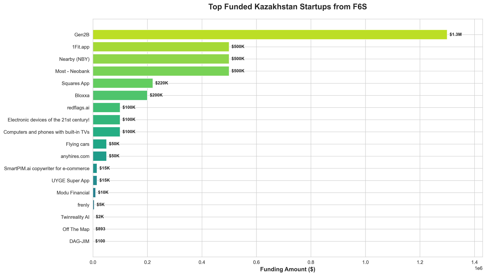
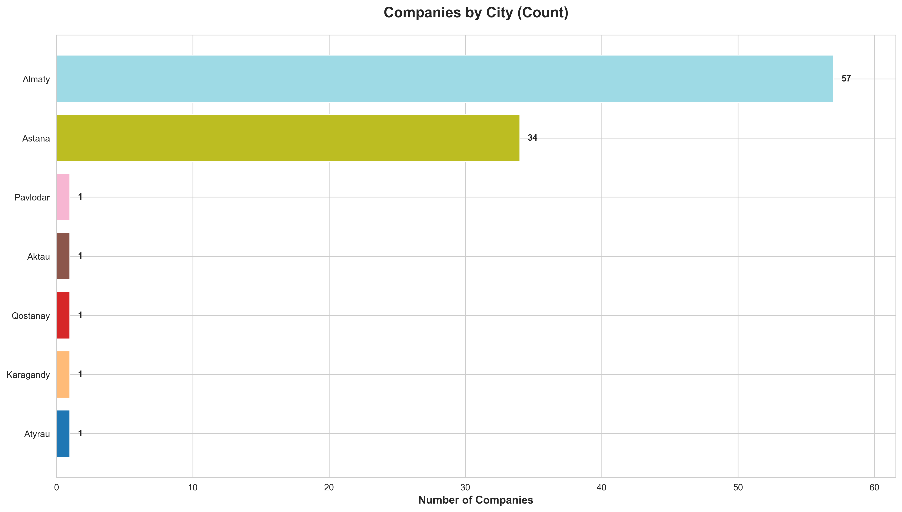
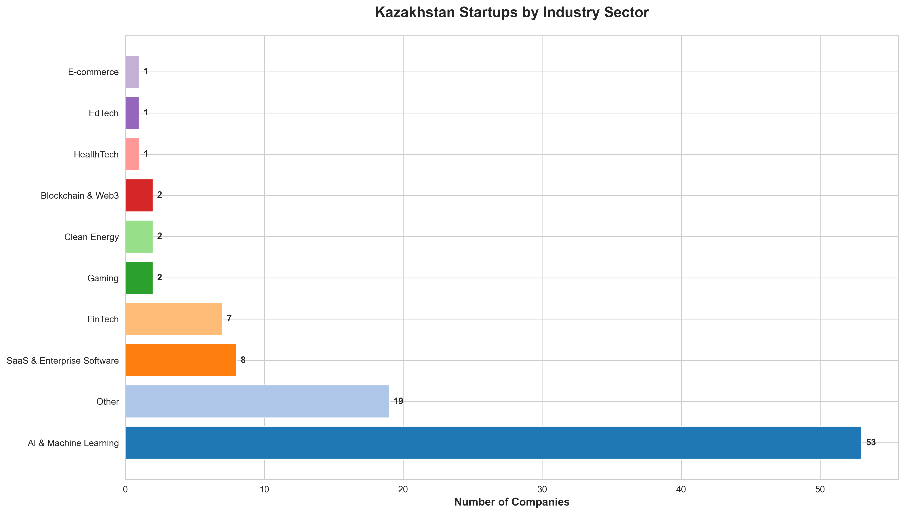
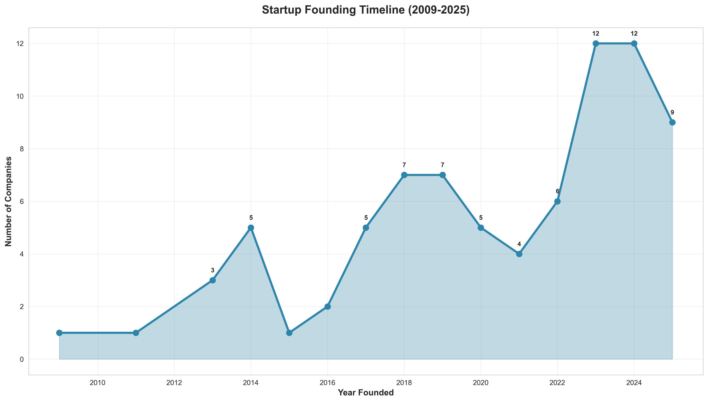
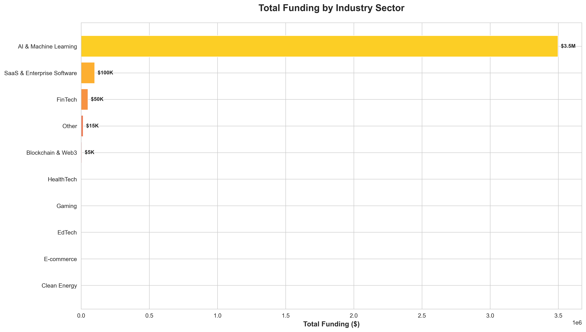
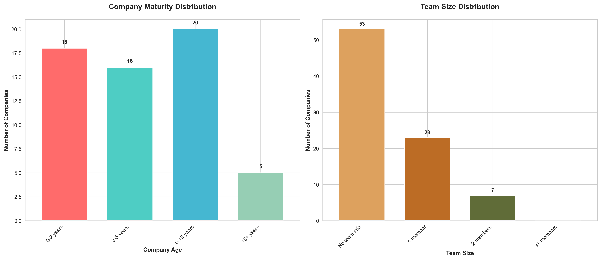
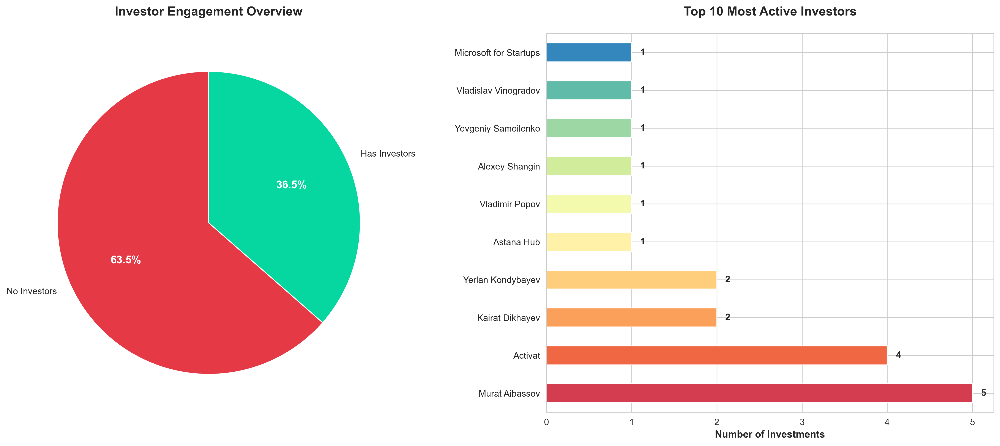
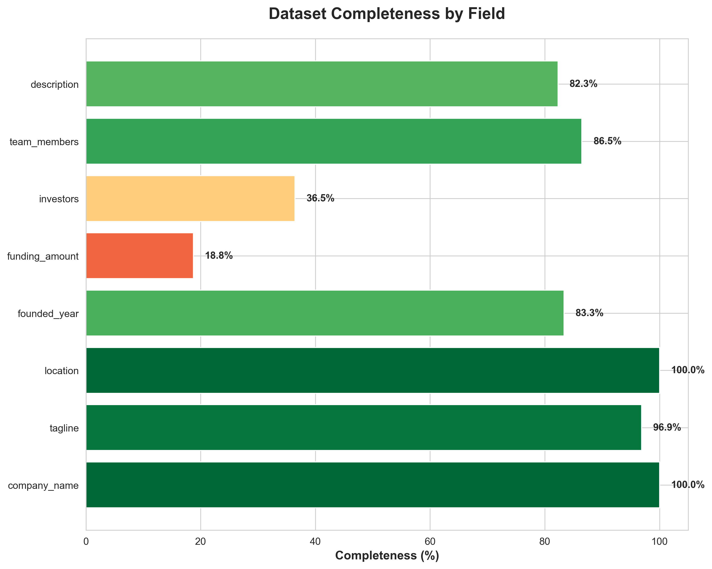

# Kazakhstan Startup Ecosystem Analysis - F6S Data

## Overview

This repository contains a comprehensive analysis of **97 Kazakhstan-based startups** listed on F6S, revealing the current state of the country's entrepreneurial ecosystem. The analysis covers funding patterns, geographic distribution, industry sectors, team composition, and investor engagement.

---

## Dataset Summary

- **Total Companies**: 97
- **Primary Cities**: Almaty (57), Astana (34)
- **Funding Reported**: 18 companies (18.8%)
- **Total Funding**: ~$4.1M across all companies
- **Companies with Investors**: 35 (36.5%)
- **Peak Founding Years**: 2023-2024 (12 companies each)

---

## Key Visualizations

### 1. Funding Distribution

**Top Funded Startups:**
- **Gen2B** - $1.3M (AI-First business transformation)
- **1Fit.app** - $500K (Fitness membership platform)
- **Nearby (NBY)** - $500K (LegalTech platform)
- **Most Neobank** - $500K (Digital banking for MSMEs)

### 2. Geographic Distribution

**City Breakdown:**
- **Almaty**: 57 companies (58.8%)
- **Astana**: 34 companies (35.1%)
- **Others**: 6 companies (6.2%) - Pavlodar, Aktau, Qostanay, Karagandy, Atyrau

### 3. Industry Distribution

**Sector Analysis:**
- **AI & Machine Learning**: 53 companies (54.6%) - Dominant sector
- **SaaS & Enterprise Software**: 8 companies (8.2%)
- **FinTech**: 7 companies (7.2%)
- **Blockchain & Web3**: 2 companies (2.1%)
- **Gaming**: 2 companies (2.1%)
- **Clean Energy**: 2 companies (2.1%)
- **Other**: 19 companies (19.6%)

### 4. Founding Timeline

**Trend Analysis:**
- **Recent Surge**: 33 companies founded in 2023-2025
- **Peak Years**: 2023 and 2024 (12 companies each)
- **Growth Period**: 2018-2019 (7 companies each)
- **Early Stage**: 2009-2017 (lower but steady activity)

### 5. Funding by Industry

**Investment Concentration:**
- **AI & Machine Learning**: $3.5M (85.4% of total funding)
- **SaaS & Enterprise Software**: $100K
- **FinTech**: $50K
- **Other Sectors**: Minimal to no funding reported

### 6. Maturity and Team Size

**Company Age:**
- **0-2 years**: 18 companies (30.5%)
- **3-5 years**: 16 companies (27.1%)
- **6-10 years**: 20 companies (33.9%)
- **10+ years**: 5 companies (8.5%)

**Team Composition:**
- **No team info**: 53 companies (63.9%)
- **1 member**: 23 companies (27.7%)
- **2 members**: 7 companies (8.4%)
- **3+ members**: Rare

### 7. Investor Engagement

**Investor Statistics:**
- **No Investors**: 62 companies (63.5%)
- **Has Investors**: 35 companies (36.5%)

**Most Active Investors:**
1. **Murat Aibassov** - 5 investments
2. **Activat** - 4 investments
3. **Kairat Dikhayev** - 2 investments
4. **Yerlan Kondybayev** - 2 investments

### 8. Data Completeness

**Field Completeness:**
- **Company Name**: 100%
- **Location**: 100%
- **Tagline**: 96.9%
- **Team Members**: 86.5%
- **Founded Year**: 83.3%
- **Description**: 82.3%
- **Investors**: 36.5%
- **Funding Amount**: 18.8% ⚠️

---

## Actionable Insights

### 🚀 For Startup Founders

#### 1. **Differentiate Beyond AI**
- **Issue**: 55% of startups are in AI/ML, creating extreme competition
- **Action**: Consider underserved sectors like HealthTech, EdTech, CleanTech, or E-commerce
- **Opportunity**: FinTech has only 7 companies despite Kazakhstan's growing digital banking needs

#### 2. **Build a Team Early**
- **Issue**: 64% of companies have no team information; many are solo founders
- **Action**: Prioritize co-founder recruitment and team building
- **Impact**: Teams of 2-3 show better funding outcomes (e.g., Gen2B with 3 members raised $1.3M)

#### 3. **Document Your Funding Journey**
- **Issue**: Only 18.8% reported funding data
- **Action**: Transparently share funding milestones to attract investors and build credibility
- **Benefit**: Creates visibility and trust within the ecosystem

#### 4. **Target Growth Beyond Almaty/Astana**
- **Issue**: 94% of startups are in just two cities
- **Action**: Explore regional expansion to Shymkent, Aktobe, or Karagandy
- **Advantage**: Less competition, government incentives for regional development

#### 5. **Accelerate Investor Engagement**
- **Issue**: 63.5% have no investor relationships
- **Action**:
  - Join accelerators (Astana Hub, MOST Ventures)
  - Attend pitch events and demo days
  - Build relationships with active investors like Murat Aibassov and Activat
  - Consider international investors (TMT Investments, Quest Ventures examples)

### 💰 For Investors

#### 1. **Early-Stage Opportunity**
- **Insight**: 58% of companies are 0-5 years old
- **Action**: Focus on seed and Series A investments with high growth potential
- **Target**: Companies with clear traction in underserved sectors

#### 2. **Diversify Beyond AI**
- **Risk**: 85% of funding is concentrated in AI/ML
- **Action**: Build a balanced portfolio across FinTech, SaaS, HealthTech, and B2B sectors
- **Example**: Nearby (NBY) in LegalTech and Most Neobank in FinTech show strong use cases

#### 3. **Support Team Building**
- **Opportunity**: Many solo founders need operational support
- **Value-Add**: Provide talent acquisition support, mentorship networks, and co-founder matching
- **Impact**: Help founders scale from idea to execution team

#### 4. **Fill the Funding Gap**
- **Reality**: Average funding is only $229K where reported
- **Action**: Create micro-VC funds ($50K-$250K) tailored to local ecosystem stage
- **Focus**: Bridge the gap between bootstrapping and institutional capital

#### 5. **Partner with Serial Investors**
- **Strategy**: Co-invest with active local investors (Murat Aibassov, Activat, Kairat Dikhayev)
- **Benefit**: Leverage local knowledge, due diligence, and network effects

### 🏛️ For Ecosystem Builders & Policy Makers

#### 1. **Address Data Transparency**
- **Problem**: Only 18.8% report funding, 63.9% lack team info
- **Solution**: Create incentives for startups to share data (tax breaks, grant eligibility)
- **Tools**: Build a centralized startup registry with standardized metrics

#### 2. **Reduce Geographic Concentration**
- **Issue**: 94% in Almaty/Astana
- **Action**:
  - Establish regional innovation hubs in tier-2 cities
  - Offer tax incentives for startups in underserved regions
  - Create remote-first support programs

#### 3. **Industry Diversification Programs**
- **Challenge**: Over-reliance on AI/ML (55%)
- **Initiative**:
  - Launch sector-specific accelerators (HealthTech, AgriTech, CleanTech)
  - Provide grants for non-AI innovation
  - Promote cross-sector collaboration

#### 4. **Strengthen Investor Networks**
- **Gap**: 63.5% of startups have no investors
- **Action**:
  - Host regular pitch events and demo days
  - Create angel investor networks with tax benefits
  - Attract international VCs with co-investment programs
  - Establish government-backed matching funds

#### 5. **Support Post-2023 Cohort**
- **Opportunity**: 33 companies founded in 2023-2025 need immediate support
- **Programs**:
  - Accelerated mentorship programs
  - Subsidized co-working spaces
  - Legal and accounting support packages
  - Go-to-market strategy workshops

#### 6. **Facilitate Team Formation**
- **Need**: Many solo founders struggle to build teams
- **Solutions**:
  - Co-founder matching platforms
  - Talent pipelines from universities
  - Remote hiring subsidies
  - Equity compensation education programs

### 🎯 For International Partners

#### 1. **Market Entry Strategy**
- **Opportunity**: Young ecosystem with 94% of companies founded since 2009
- **Access**: Partner with Astana Hub (appears as investor in dataset)
- **Focus**: Bring expertise in scaling, go-to-market, and international expansion

#### 2. **Knowledge Transfer Programs**
- **Need**: Many first-time founders with limited scaling experience
- **Action**: Offer workshops, mentorship, and executive education
- **Topics**: Fundraising, product-market fit, international expansion

#### 3. **Co-Investment Opportunities**
- **Model**: Partner with local investors (Activat, Murat Aibassov, Kairat Dikhayev)
- **Benefit**: Reduce risk through local expertise while accessing emerging market returns
- **Target**: Companies with $500K+ funding showing early traction

---

## Sector Deep Dives

### AI & Machine Learning (53 companies)

**Strengths:**
- Largest sector with 54.6% of all companies
- Attracted 85% of total funding ($3.5M)
- Diverse applications: GenAI, computer vision, NLP, automation

**Notable Companies:**
- **Gen2B** - AI-First business transformation platform ($1.3M)
- **redflags.ai** - Procurement intelligence ($100K)
- **Sonetix AI** - AI-powered voice automation (2025)
- **IceCore.ai** - Customer conversation analytics (2025)

**Concerns:**
- High competition and potential market saturation
- Many companies lack clear differentiation
- Risk of AI bubble burst

**Recommendations:**
- Focus on vertical-specific AI solutions (e.g., healthcare, agriculture)
- Emphasize use case validation over technology features
- Build defensible moats through proprietary data or integrations

### FinTech (7 companies)

**Opportunity Areas:**
- Digital banking for underserved segments (MSMEs, freelancers)
- Payment infrastructure improvements
- Investment platforms and wealth management
- Blockchain-based financial services

**Key Players:**
- **Most Neobank** - Digital banking for MSMEs ($500K)
- **TABYS** - Investment app
- **Kredit24.kz** - Quick online loans (founded 2013)

**Growth Potential:**
- Kazakhstan's push for digital economy
- Large unbanked/underbanked population
- Cross-border payment needs in Central Asia

### SaaS & Enterprise Software (8 companies)

**Focus Areas:**
- Business process automation
- CRM and customer engagement
- Project management and collaboration
- Vertical-specific solutions

**Challenges:**
- Limited domestic market size
- Need for international expansion
- Competition from global SaaS players

**Success Factors:**
- Target regional markets (Central Asia, CIS)
- Build integrations with local systems
- Offer local language support and customer service

---

## Critical Success Factors

### 1. **Funding Accessibility**
- Currently only 18.8% have reported funding
- Average ticket size is too small ($229K where reported)
- Need for more active angel investors and early-stage VCs

### 2. **Team Building**
- 64% lack team information or are solo founders
- Critical need for co-founder matching and talent acquisition support
- Technical talent shortage in specialized areas

### 3. **Market Validation**
- Many startups lack clear product-market fit evidence
- Need for more structured validation frameworks
- Customer acquisition costs often underestimated

### 4. **International Expansion**
- Domestic market too small for unicorn growth
- Must target CIS countries, Middle East, or Asia
- Requires understanding of cross-border regulations and partnerships

### 5. **Investor Relations**
- 63.5% have no investors - indicates either bootstrapping or failed fundraising
- Need for better pitch skills and investor storytelling
- Lack of warm introductions and network effects

---

## Emerging Trends (2023-2025 Cohort)

### Recent Focus Areas:
1. **Generative AI Applications** - ChatGPT-like tools for specific use cases
2. **AI Voice Technology** - Voice automation and conversation intelligence
3. **B2B SaaS** - Enterprise solutions for procurement, HR, and operations
4. **Neobanking** - Digital-first banking for SMEs and consumers
5. **LegalTech & RegTech** - Compliance and legal automation

### Characteristics of Recent Founders:
- More technically sophisticated than earlier cohorts
- Higher awareness of global startup trends
- Stronger emphasis on AI/ML integration
- Focus on B2B over B2C models

---

## Recommendations by Stakeholder

| Stakeholder | Top Priority Actions |
|-------------|---------------------|
| **Founders** | 1. Build a core team 2. Differentiate from AI competition 3. Secure first investor/advisor 4. Document metrics and progress |
| **Investors** | 1. Diversify beyond AI/ML 2. Provide hands-on support 3. Co-invest with local partners 4. Focus on Series A gap |
| **Government** | 1. Create regional innovation hubs 2. Tax incentives for team hiring 3. Investor tax breaks 4. Data transparency requirements |
| **Accelerators** | 1. Sector-specific programs 2. International expansion support 3. Investor matching events 4. Team building workshops |
| **International Partners** | 1. Knowledge transfer programs 2. Co-investment structures 3. Market access support 4. Mentor matching |

---

## Dataset Limitations

### Data Quality Issues:
1. **Funding Data**: Only 18.8% completeness - many companies may be stealth or bootstrapped
2. **Team Information**: 64% lack team member details
3. **Investor Information**: 63.5% show no investors - may be incomplete rather than accurate
4. **Founded Year**: 16.7% missing - makes timeline analysis incomplete
5. **Description Quality**: Varying levels of detail and professionalism

### Interpretation Notes:
- Numbers represent F6S-listed companies only (not entire ecosystem)
- Self-reported data may have accuracy issues
- Missing funding data ≠ no funding received
- Many companies may be inactive or pivoted

---

## Next Steps

### For This Analysis:
1. **Validate Data**: Cross-reference with Crunchbase, Astana Hub, and MOST Ventures databases
2. **Interview Founders**: Conduct qualitative research with top 20 companies
3. **Track Progress**: Monitor 2023-2025 cohort over next 12 months
4. **Expand Scope**: Include accelerators, corporate ventures, and international investors

### For the Ecosystem:
1. **Create Dashboard**: Real-time tracking of Kazakhstan startup metrics
2. **Annual Report**: Publish comprehensive ecosystem analysis
3. **Founder Survey**: Gather insights on challenges and needs
4. **Investor Mapping**: Identify all active investors and their focus areas

---

## Conclusion

Kazakhstan's startup ecosystem shows **strong momentum** with 33 companies founded in 2023-2025, but faces critical challenges:

### ✅ Strengths:
- Growing AI/ML expertise and talent pool
- Geographic concentration enabling network effects
- Government support through Astana Hub
- Young, energetic founder population

### ⚠️ Challenges:
- Over-concentration in AI/ML (55% of companies)
- Limited funding availability (18.8% reporting)
- Weak investor engagement (63.5% without investors)
- Small team sizes and solo founders
- Geographic concentration limits regional impact

### 🎯 Critical Priorities:
1. **Increase investor activity** - More angels, micro-VCs, and institutional capital
2. **Support team building** - Co-founder matching and talent acquisition
3. **Encourage diversification** - Beyond AI into FinTech, HealthTech, AgriTech
4. **Improve data transparency** - Standardized reporting and metrics
5. **Regional expansion** - Innovation hubs beyond Almaty/Astana

The ecosystem is at a **critical inflection point**. With proper support, the 2023-2025 cohort could mature into scalable companies that put Kazakhstan on the global startup map. Without intervention, many will struggle to survive the "valley of death" between founding and product-market fit.

---

## Data Sources

- **Primary Dataset**: `f6s_kazakhstan_companies.csv`
- **Platform**: F6S (https://www.f6s.com)
- **Collection Date**: 2025
- **Companies Analyzed**: 97
- **Visualizations**: 8 charts covering funding, geography, industry, timeline, team, investors, and data quality

---

## Contact & Contributions

For questions, updates, or collaboration opportunities related to this analysis:
- Open an issue in this repository
- Contribute additional data sources
- Share insights from the founder/investor community

---

**Last Updated**: November 2025
**Analysis Version**: 1.0
**License**: Open for educational and ecosystem development purposes
